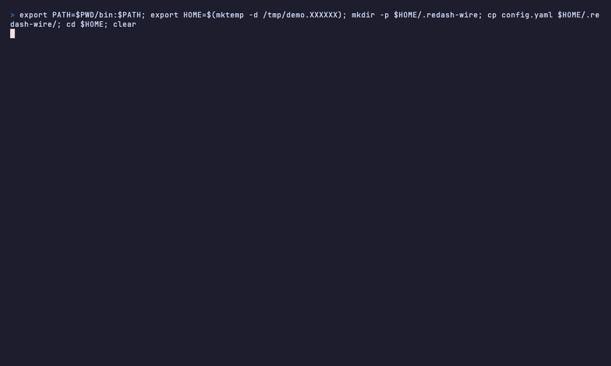

# redash-wire

**Query [Redash](https://redash.io/) from any PostgreSQL or MySQL client.**

`redash-wire` lets you connect apps like TablePlus or DBeaver straight to
Redash and query your data sources as if they were normal databases. No Redash
UI, no pasting SQL into the query editor.



## How it works

```
psql / TablePlus / DBeaver  ──▶  redash-wire  ──▶  Redash  ──▶  your data sources
```

To your client it looks like a regular Postgres or MySQL server. Underneath,
it's talking to the Redash REST API.

Connect using the name of a Redash data source as the database name (on MySQL,
pick one with `USE <name>`). Run a query and the proxy hands it to the Redash
API, waits for the job to finish, and gives you back the rows as a normal result
set. Schema browsing and the usual connection chatter are answered locally, so
GUI clients can list tables without complaining.

## Install

On macOS or Linux, one line:

```bash
curl -fsSL https://raw.githubusercontent.com/lhpalacio/redash-wire/main/install.sh | sh
```

The script detects your OS and architecture, downloads the latest release, verifies the
checksum, and installs to `/usr/local/bin` (set `BIN_DIR` or `VERSION` to
override). Prebuilt binaries for Linux and macOS (amd64 + arm64) are on the
[releases page](https://github.com/lhpalacio/redash-wire/releases); Windows is
not supported.

Run `redash-wire`. With no config present, the first run drops you into a setup
wizard: it asks for your Redash URL and API key, tests the connection, and
writes a config with one profile. It also enables a listener for each data
source type it finds (Postgres, MySQL) and leaves the rest commented out, ready
to turn on later.

Config is looked up in order: `-config <path>`, then `./config.yaml`, then
`~/.redash-wire/config.yaml`. To run against more than one Redash, add profiles
by hand (see below).


## Configuration

The wizard writes a single profile to `~/.redash-wire/config.yaml`. To talk to
more than one Redash, add profiles to that file by hand and pick one with the
`-profile` flag. A config with two profiles looks like this
([`config.example.yaml`](config.example.yaml)):

```yaml
# Top-level keys are defaults for every profile; a profile can override them.
# At least one listener must be configured.
postgres_listen_addr: "127.0.0.1:15432"  # omit to disable; keep on loopback unless you mean to expose it
mysql_listen_addr: "127.0.0.1:13306"     # omit to disable

# Proxy login. Defaults to redash-wire / supersecret; change them for anything
# beyond loopback.
username: "redash-wire"
password: "supersecret"

poll_interval: "500ms"  # how often to poll Redash for query completion
poll_timeout: "120s"    # give up on a query after this long

# Profile used when the -profile flag is omitted.
default_profile: integration

profiles:
  integration:
    redash_url: "https://redash.integration.example.com"
    api_key: "${REDASH_INTEGRATION_API_KEY}"  # ${ENV_VAR} expansion works for redash_url and api_key
  prod:
    redash_url: "https://redash.prod.example.com"
    api_key: "${REDASH_PROD_API_KEY}"
    postgres_listen_addr: "127.0.0.1:25432"  # per-profile override
```

Unknown keys fail at startup, so typos don't get silently ignored.

Traffic between client and proxy is plaintext (no TLS), and any client that
authenticates can reach everything the configured API key can. Keep the
listeners on localhost unless you trust the network.

## CLI

With no arguments, or with only flags, `redash-wire` starts the proxy. The
serve flags are `-config <path>`, `-profile <name>`, `-debug`, `-version`,
`-log-format <text|json>`, `-exit-on-stdin-eof`, and `-wait-for-redash`.

`-log-format json` writes every log event as a JSON object on stderr with an
RFC3339 timestamp. It also drops the startup banner and the setup wizard, since
a program is reading the output. `-exit-on-stdin-eof` shuts the proxy down when
its stdin reaches EOF, which is what happens when the process that spawned it
goes away. macOS reparents a child process when its parent dies, so without this
a supervising app that gets force-quit leaves the proxy running and still
holding its listen ports.

`-wait-for-redash` changes what an unreachable Redash means at startup. Without
it the proxy exits 1, which is what a script or a container wants. With it the
proxy binds its listeners anyway and refuses connections until Redash answers,
so a supervising app that launches before the VPN is up gets a proxy that
recovers on its own.

While serving, the proxy asks Redash for its data sources every 10 seconds,
giving each answer 5 seconds to arrive. One call answers two questions: whether
Redash is reachable, and what it holds now, so a data source added while the
proxy runs shows up without a restart. Two failures in a row close the gate,
and the second probe runs a second after the first fails rather than a full
interval later, so a dropped VPN closes the gate in about ten seconds. The
startup probe is the exception: nothing has proved Redash reachable yet and
there is no session to protect, so one failure is enough, and it gets 10
seconds instead of 5 so one slow first answer doesn't stop a start that would
have worked. While the gate is closed the proxy drops open SQL sessions and
refuses new ones, with the ports still bound so recovery needs nothing from you.
Postgres clients are told the reason at login and when they are dropped. A MySQL
client is told on its next connection or query, because go-mysql owns the write
side of a session already under way. A query that dies on an
infrastructure error triggers a probe immediately instead of waiting out the
interval. A 401, 403 or 404 reads differently from a timeout, and backs off to
five minutes: a rejected key needs you to edit the config, a dropped VPN does
not.

A first argument that isn't a flag is a subcommand. Each one answers a question
and exits, so a script or a supervising app can ask without starting a server:

```bash
redash-wire config [-json] [-show-secrets] [-config <path>]
redash-wire datasources [-json] [-config <path>] [-profile <name>]
redash-wire init -url <url> [-profile <name>] [-username <u>] [-password <p>] [-config <path>] [-json]
redash-wire help
```

Without `-json` each command prints the same information as text.

`config` shows the resolved configuration for every profile: which file it
read, where that path came from, and what each profile ends up with after
defaults and `${ENV_VAR}` expansion. It reports a missing config file as
`"exists": false` and exits 0. You run `config` to find out whether setup is
needed, and a fresh install has to look different from a broken config. Every
other command treats a missing config as `not_configured` and exits non-zero.
`config` omits the API key unless you pass `-show-secrets`, and an `api_key_set`
boolean says whether one is configured. It always includes the proxy username
and password, since you need them to build a connection string.

`datasources` lists one profile's Redash data sources with the wire protocol
each is reachable over. The classification comes from the proxy itself, so an
empty `wire` means the proxy won't serve that source:

```bash
$ redash-wire datasources -json
[
  {
    "id": 4,
    "name": "BigQuery Warehouse",
    "type": "bigquery",
    "wire": ""
  },
  {
    "id": 1,
    "name": "Production PG",
    "type": "pg",
    "wire": "postgres"
  }
]
```

`init` is the setup wizard without the terminal: the same checks against Redash,
the same config file, driven by flags. It reads the API key from stdin. A flag
would put the key in argv, which any local process can read through `ps`, and in
your shell history as well:

```bash
pbpaste | redash-wire init -url https://redash.example.com
```

It won't overwrite a config that already exists; pass `-config` to write
somewhere else.

Stdout carries command results and nothing else, and stays empty while the proxy
is serving. The log stream always goes to stderr, so a caller can capture one
without the other.

On success a command prints its payload and exits 0. On failure it exits 2 for a
usage mistake and 1 for everything else; with `-json` it prints
`{"error":{"code":"...","message":"..."}}` on stdout, and without it prints
`error: <message>` on stderr. The codes are a stable contract, so branch on the
code rather than on the message:

- `usage`: a required flag is missing, or the API key wasn't piped in.
- `not_configured`: no config file exists at any of the lookup paths.
- `invalid_config`: the file is there but doesn't load, whether from bad YAML, an
  unknown key, or a profile that fails validation.
- `profile_not_found`: `-profile` names a profile the config doesn't have.
- `connection_failed`: Redash didn't answer, or answered with something that
  isn't about the request itself, such as a 500.
- `authentication_failed`: Redash rejected the request. It answers a bad API key
  with a 404 rather than a 401, and a URL pointing at something that isn't Redash
  looks the same from the outside, so one code covers both cases and the
  message names them.
- `config_exists`: `init` found a config already in place and left it alone.
- `io_error`: `redash-wire` couldn't read or write a file.

An unknown command or an unparseable flag exits 2 with the usage text on stderr
and no JSON.

## macOS app

There's a menu bar app too, so the proxy doesn't need a terminal window of its
own. It has no Dock icon, needs macOS 13 or newer, and starts and stops
`redash-wire` as a child process.

From the menu you can:

- Choose which profile the proxy serves, and start and stop it. Picking a
  profile runs it: a live proxy restarts on the new one, a stopped or failed
  one starts. One profile runs at a time. The app starts `default_profile` on
  its own at launch, so with Launch at Login on the proxy is up before you
  open the menu.
- Browse the running proxy's Redash data sources. The list appears when you
  start it and empties when you stop, because the proxy is what reports it. The
  menu keeps the ones it can't serve in their own section, so you can see why a
  source is absent. Every servable one copies a `psql` or `mysql` command, or a
  connection URI, with the data source already filled in as the database name.
- Copy the profile-level details from the Connect submenu: the psql or mysql
  command, the username, the password.
- See whether Redash itself is answering. The proxy polls it while running, so
  the menu says so within about fifteen seconds of the VPN dropping, rather
  than the next time a query fails.
- Follow the proxy's log stream in a window you can filter by level and by text.
- Turn on launch at login.
- Check for a new release. It compares the app's version against the latest tag
  on GitHub and opens the release page. Nothing downloads or installs itself. A
  background check runs once a day and adds a menu row when there's something
  new.
- Open `config.yaml` in a text editor with Settings…, and apply your edits with
  Reload Configuration.
- Read the proxy's state off the dot beside the status line: grey stopped,
  yellow starting, green running, amber running but cut off from Redash, red
  failed or a rejected API key. The menu bar icon carries the same distinction,
  since that's the part you can see without opening anything.

The first run opens a setup sheet that asks for your Redash URL and API key and
hands them to `redash-wire init`. Only the binary ever writes `config.yaml`, so
there's no second implementation of the format to drift out of step. After setup
the app only reads that file, and it watches it, so an edit you make by hand
shows up without a restart.

A few decisions behind it that aren't obvious from the outside:

- The app carries its own copy of `redash-wire` in `Contents/Resources` and runs
  that one, so the app and the binary can't disagree about the JSON contract
  between them.
- It always passes `-config` explicitly. It doesn't control its working
  directory, and `redash-wire` falls back to `./config.yaml`, so a stray file
  there could otherwise point the proxy at somebody else's Redash.
- It spawns the proxy with `-exit-on-stdin-eof`, so force-quitting the app can't
  leave an orphan behind still holding the listen ports.
- It also passes `-wait-for-redash`. An unreachable Redash is then a state the
  menu shows rather than a reason to exit, and the proxy recovers by itself when
  the VPN comes back.
- A proxy that dies before it ever starts listening died of something permanent,
  like a port already in use or a profile that doesn't parse, so the app shows
  the reason and doesn't retry. It restarts one that dies after it was serving,
  with backoff, three times at most.
- The data source list comes from the running proxy's health events. The app
  never asks Redash for it directly: two callers asking the same question can
  get different answers, and the proxy's copy is the one that resolves the
  database name you connect with. With the proxy stopped there is nothing to
  list, and the app makes no request.
- The app switches on the `event` field of each JSON log line, never on the
  message text. A reworded log message used to be enough to break the menu.
- Copying a password clears it from the clipboard 60 seconds later, unless you
  copied something else in the meantime.
- Settings… opens the config with whatever app claims `.yaml`, or TextEdit if
  nothing does.
- Reload Configuration restarts a running proxy only when the profile it serves
  changed. The file watcher never restarts it: one save fires the watcher
  several times, because the config is written with a temp file and a rename and
  editors leave swap files in the same directory.
- The ⌘, and ⇧⌘, shortcuts work only while the menu is open. Without a Dock
  icon the app has no app menu to register them with.

Build and run the app from the repo root:

```bash
make macos       # builds build/RedashWire.app
make macos-run   # builds it and opens it
```

That needs full Xcode 26 or newer, not just the Command Line Tools, because it
drives `xcodebuild`. The app picks up Liquid Glass from the macOS 26 SDK, so an
older toolchain builds a working app without it. It still runs on macOS 13,
where the two windows skip the glass.

The build compiles `redash-wire` for arm64 and amd64, merges them
into one universal binary, and embeds it in the bundle. It signs the nested
binary and then the bundle around it, and fails if either one didn't come out
universal.

The signature is ad-hoc and the app isn't notarized, so macOS quarantines a copy
that arrives over the network and Gatekeeper blocks its first launch. Right-click
the app and choose Open, or run `xattr -dr com.apple.quarantine
/path/to/RedashWire.app`. Either one means vouching for a binary Apple hasn't
checked, which is worth a moment's thought for an app you're about to give a
Redash API key. Build it from a checkout you trust.

## Supported SQL & limitations

It runs read queries against any PostgreSQL- or MySQL-compatible Redash data
source. A few things worth knowing:

- One statement per request. Multi-statement batches (`BEGIN; ...; COMMIT` in a
  single message) get rejected outright rather than half-executed.
- Writes are forwarded, but Redash never reports how many rows changed, so
  neither can the proxy. Postgres clients get a `NOTICE` to that effect. Add
  `RETURNING` when you need a count.
- Introspection is best-effort. The common `pg_catalog` / `information_schema`
  queries (and MySQL's `SHOW` / `information_schema`) are answered from the
  cached schema; anything exotic may come back partial. Every column type
  reports as `text`, since Redash's schema endpoint doesn't expose real types.
- Numbers stay exact. Integers and decimals never round-trip through `float64`;
  a value too big for the native type comes back as text rather than getting
  mangled.
- The extended/prepared-statement protocol isn't supported. Use the simple
  query protocol.

## Contributing

Development setup, tests, and the release process are documented in
[CONTRIBUTING.md](CONTRIBUTING.md).
