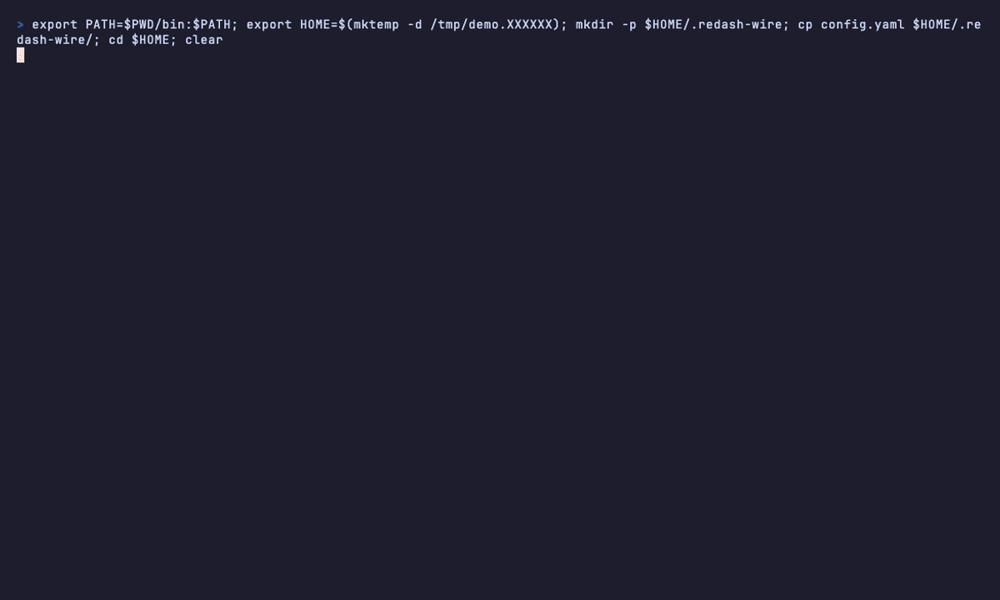
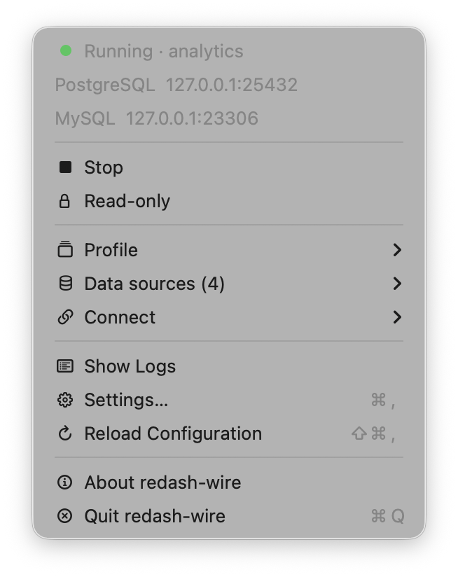
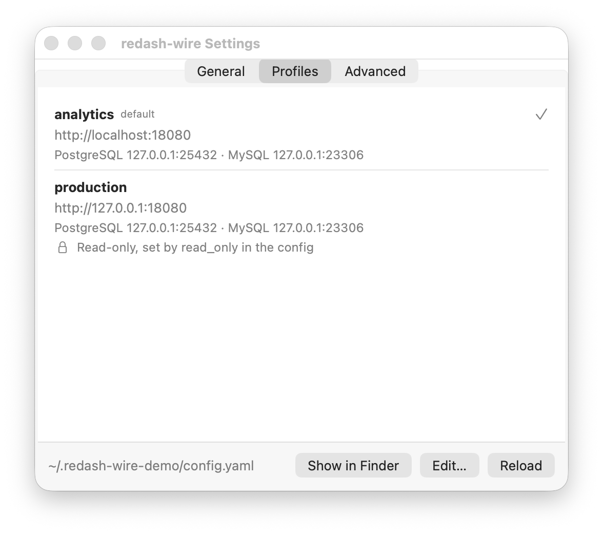

# redash-wire

Query [Redash](https://redash.io/) data sources from any PostgreSQL or MySQL
client: psql, TablePlus, DBeaver, DataGrip.



```
your client  ──▶  redash-wire  ──▶  Redash API  ──▶  your data sources
```

redash-wire speaks the PostgreSQL and MySQL wire protocols. Each query runs
through Redash and comes back as a normal result set. The database name is
the Redash data source name.

## Install

### macOS app

A menu bar app that runs the proxy for you. It bundles the CLI and needs
macOS 13 or later.

1. Download `RedashWire_<version>_macos_universal.zip` from the
   [releases page](https://github.com/lhpalacio/redash-wire/releases).
2. Move `RedashWire.app` to Applications.
3. The app is not notarized, so clear the quarantine flag once:

   ```bash
   xattr -dr com.apple.quarantine /Applications/RedashWire.app
   ```

4. Open it and enter your Redash URL and API key.

### CLI

macOS and Linux, amd64 and arm64:

```bash
curl -fsSL https://raw.githubusercontent.com/lhpalacio/redash-wire/main/install.sh | sh
redash-wire   # the first run asks for your Redash URL and API key
```

The script installs to `/usr/local/bin`. Set `BIN_DIR` or `VERSION` to change
that. Windows is not supported.

## Connect

```bash
psql  -h 127.0.0.1 -p 15432 -U redash-wire -d "Analytics"
mysql -h 127.0.0.1 -P 13306 -u redash-wire -p -D "Orders"
```

The password is `supersecret` until you set one in the config. Your Redash API
key is on your Redash profile page, `<redash-url>/users/me`.

## The macOS app

<p>
  
  
</p>

- Lists your data sources. Open one in TablePlus or any app that handles
  `postgresql://` and `mysql://` links, or copy a `psql` or `mysql` command.
- Shows whether Redash is reachable, and what to do when it isn't: VPN down,
  API key rejected, port in use.
- Gives up a start that can't reach Redash after 2 minutes, and tries again
  when the network changes. Once connected, it keeps the proxy up through an
  outage so open sessions survive.
- Notifies you when Redash goes offline or the proxy needs attention.
- Locks a profile to read-only from the menu.
- Writes its log to `~/Library/Logs/RedashWire/`.

Build it from source with `make macos` (needs Xcode).

## Configuration

The proxy reads `-config <path>`, then `./config.yaml`, then
`~/.redash-wire/config.yaml`. See [`config.example.yaml`](config.example.yaml)
for every key.

```yaml
postgres_listen_addr: "127.0.0.1:15432"  # omit to disable
mysql_listen_addr: "127.0.0.1:13306"     # omit to disable
username: "redash-wire"
password: "supersecret"
default_profile: staging

profiles:
  staging:
    redash_url: "https://redash.staging.example.com"
    api_key: "${REDASH_STAGING_API_KEY}"
  prod:
    redash_url: "https://redash.example.com"
    api_key: "${REDASH_PROD_API_KEY}"
    postgres_listen_addr: "127.0.0.1:25432"
    read_only: true
```

Top-level keys apply to every profile, and a profile can override any of them.
`${ENV_VAR}` works in `redash_url` and `api_key`. Unknown keys fail at startup.

Traffic between client and proxy is plaintext, and any client that logs in can
query everything the API key can reach. Keep the listeners on `127.0.0.1`.

## Read-only mode

`read_only: true` in a profile, or `redash-wire -read-only`, refuses every
statement that is not a read before it reaches Redash.

- Allowed: `SELECT`, `WITH … SELECT`, `VALUES`, `TABLE`, `SHOW`, `DESCRIBE`,
  and `EXPLAIN` of those.
- Refused: everything else, including `SELECT … INTO`, `SELECT … FOR UPDATE`
  and data-modifying CTEs. Clients get the standard read-only error: SQLSTATE
  `25006` on PostgreSQL, `1290` on MySQL.

The check matches statement text. A function with side effects, such as
`setval()`, gets through. For a hard boundary, give the Redash data source a
read-only database user.

## CLI reference

| Flag | |
|---|---|
| `-config <path>` | Config file |
| `-profile <name>` | Profile to run; defaults to `default_profile` |
| `-read-only` | Refuse writes for this run |
| `-debug` | Debug logging |
| `-log-format text\|json` | Log format |
| `-wait-for-redash` | Start listening even when Redash is unreachable, and keep retrying |
| `-exit-on-stdin-eof` | Quit when stdin closes, for supervisors |
| `-version` | Print the version |

```bash
redash-wire config [-json] [-show-secrets]          # resolved config, API key hidden
redash-wire datasources [-json] [-profile <name>]   # data sources and the wire serving each
pbpaste | redash-wire init -url <url> [-profile <name>] [-read-only] [-json]
```

`init` writes a config without prompts. It reads the API key from stdin and
won't overwrite an existing config.

The proxy checks Redash every 10 seconds, and slows to every 2 minutes while
Redash is down. `kill -USR1 $(pgrep redash-wire)` checks now.

Exit status is 0 on success, 2 for a usage error, and 1 otherwise. With
`-json`, errors print as `{"error":{"code":"…","message":"…"}}`. The codes are
stable:

| Code | Meaning |
|---|---|
| `usage` | Missing or malformed flag, or no API key on stdin |
| `not_configured` | No config file found |
| `invalid_config` | Bad YAML, unknown key, or an invalid profile |
| `profile_not_found` | `-profile` names a profile the config lacks |
| `connection_failed` | Redash didn't answer, or answered with an unrelated error |
| `authentication_failed` | Redash rejected the key, or the URL isn't Redash |
| `config_exists` | `init` found a config and left it alone |
| `io_error` | A file couldn't be read or written |

## Limitations

- One statement per query. No prepared statements: use the simple query
  protocol.
- Redash doesn't report affected rows. Add `RETURNING` to get a count.
- MySQL writes only persist when the data source has Autocommit on in Redash.
- Table and column info comes from the Redash schema: names and types, with no
  keys, indexes, defaults or nullability. The PostgreSQL catalog reports every
  column as `text`.
- A number too large for its type comes back as text.

## Contributing

See [CONTRIBUTING.md](CONTRIBUTING.md). MIT licensed.
